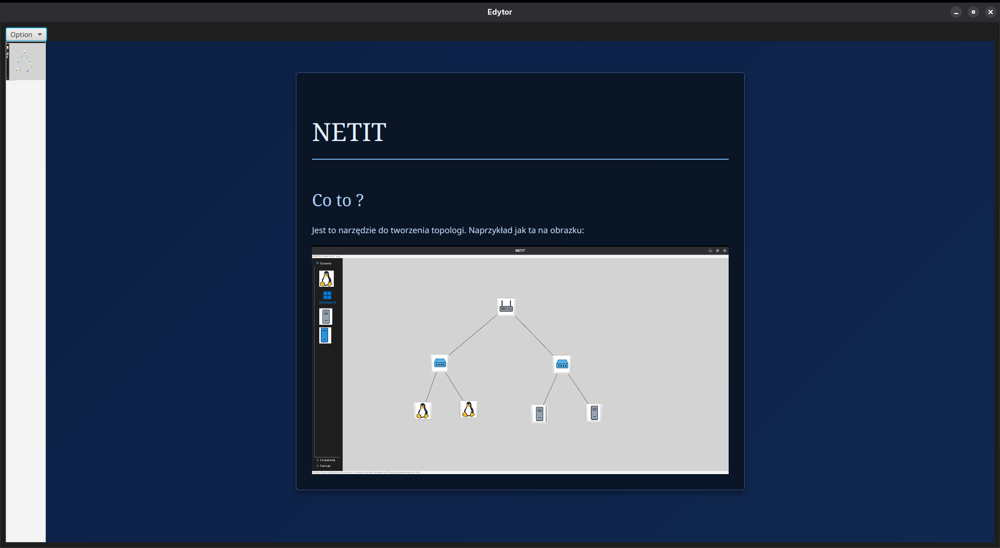

# NETIT – 1.3

**NETIT** (Network Emulation and Topology Implementation Tool) to lekkie, modularne narzędzie służące do tworzenia i emulacji topologii sieciowych. Aplikacja została napisana w Javie z wykorzystaniem JavaFX oraz biblioteki tomlj (org.tomlj) i wizualnie wzorowana na GNS3.

---

## Spis treści

1. [Funkcjonalność](#funkcjonalność)  
2. [Zakładki główne](#zakładki-główne)  
3. [Podstawowe użycie](#podstawowe-użycie)  
4. [Tworzenie notatek](#tworzenie-notatek)  
5. [Modularność i eksport](#modularność-i-eksport)  
6. [Skrypt `use.sh`](#skrypt-usesh)  
7. [Wymagania i instalacja](#wymagania-i-instalacja)  
8. [Licencja i podziękowania](#licencja-i-podziekowania)  

---

## Funkcjonalność

- **Emulacja sieci**: dodawaj i łącz różne systemy (Linux, Windows, serwery) oraz urządzenia (ruter, switch L2).  
- **Modularne notatki**: każdemu elementowi topologii możesz przypisać dowolną notatkę w formacie TOML + HTML/CSS/JS.  
- **Eksport**: generuj statyczne strony HTML z całą topologią i notatkami.  

---

## Zakładki główne

- **Systemy**  
  - Linux  
  - Windows  
  - Linux Server  
  - Windows Server  

- **Urządzenia**  
  - Ruter  
  - Switch (L2)  

- **Funkcje**  
  - Łącz (connect)  
  - Rozłącz (disconnect)  
  - Zapisz (save)  
  - Załaduj (load)  
  - Wyczyść (clear)  
  - Edytor (note editor)  
  - Eksportuj (export to HTML)  

---

## Podstawowe użycie

1. **Dodawanie elementów**  
   Kliknij w wybrany system lub urządzenie — pojawi się on w obszarze roboczym.  

2. **Przemieszczanie i łączenie**  
   Przeciągnij element w dowolne miejsce. Użyj funkcji **Łącz** / **Rozłącz**, aby tworzyć połączenia między interfejsami.  

3. **Edycja i usuwanie**  
   Kliknij na obiekt, aby otworzyć okno dialogowe z zakładkami:  
   - **del** – usuń element  
   - **info** – podstawowe dane (nazwa, typ, stan)  

4. **Automatyczne wczytywanie notatek**  
   Wszystkie notatki zapisane wcześniej w katalogu projektu są ładowane przy uruchomieniu aplikacji jako nowe zakładki.

---

## Tworzenie notatek

1. Otwórz zakładkę **Edytor**.  
2. Uzupełnij pola:  
   - **Tytuł notatki**  
   - **Typ urządzenia** (np. `Linux Server`, `Ruter`)  
   - **Styl**: `mono`, `blue` lub `gray`  
3. Wpisz zawartość, korzystając z prostej składni:

   ```text
   # Duży tytuł z linią oddzielającą
   * Mniejszy tytuł
   Zwykły tekst


4. Aby osadzić obraz, kliknij **Dodaj obraz** i wstaw tag:

   ```text
   1</img>
   ```

   gdzie `1` to indeks pliku graficznego (kolejność wczytania).

5. Przełącz się na widok podglądu, aby zobaczyć gotową notatkę.

### Przykład

```text
# NETIT
* Co to?
NETIT to narzędzie do tworzenia i emulacji topologii sieciowych. Przykład:

1</img>
```



---

## Modularność i eksport

* **Zapis:** naciśnij **Zapisz**, aby zapisać całą topologię i notatki do jednego pliku `.toml`.
* **Ładowanie:** kliknij **Załaduj**, aby wczytać wcześniej zapisany plik `.toml`.
* **Eksport:** wybierz **Eksportuj**, aby wygenerować statyczny zestaw plików HTML/CSS/JS wraz z surowymi notatkami (`.raw`).

Dzięki wbudowanemu silnikowi `javafx.web` możesz w notatkach używać pełnego HTML, CSS i JavaScriptu — wszystkie skrypty i style będą działać jak w przeglądarce.

---

## Skrypt `use.sh`

W repozytorium znajduje się skrypt `use.sh`, który automatyzuje kompilację i pakowanie:

```bash
Usage: use.sh [ --clean ] [ --no-run ] [ --set-version <version> ] [ --rpm ] [ --wininstaller ] [ --help ]

  --clean               Czyści katalog wyjściowy
  --no-run              Buduje projekt, ale nie uruchamia
  --set-version <ver>   Ustawia wersję (dowolny ciąg znaków)
  --rpm                 Buduje i tworzy repozytorium RPM
  --wininstaller        Tworzy instalator Windows (domyślnie Linux)
  --help                Wyświetla tę pomoc

Możliwe zmienne środowiskowe:
  JAVA_FX_SDK           Ścieżka do katalogu `lib` JavaFX
  MAVEN_ARGS            Dodatkowe flagi przekazywane do `mvn`
  JAVA_ARGS             Dodatkowe flagi przekazywane do `java`
```

> **Uwaga:** upewnij się, że zmienna `JAVA_FX_SDK` wskazuje na poprawny katalog z bibliotekami JavaFX, lub użyj gotowego RPM / instalatora Windows
> [Pobierz instalator / paczkę RPM (Google Drive)](https://drive.google.com/drive/folders/17C-igY_6j2UcYgBPe5AKYI2uKE18AtZN?usp=drive_link)

---

## Wymagania i instalacja

* **Java 21+**
* **Maven 3.6+**
* **JavaFX SDK** (wersja zgodna z JDK)
* Systemy: Linux, Windows

```bash
# Klonowanie repo
git clone https://github.com/Taitlesonn/netit.git
cd netit

# Budowanie i uruchamianie
./use.sh --set-version 1.3
```

---

## Licencja i podziękowania

Projekt objęty jest licencją ISC.

🛈 Część ikon została wygenerowana z pomocą AI (ChatGPT by OpenAI) i jest dostosowana do potrzeb projektu.

*Happy network emulating!*


